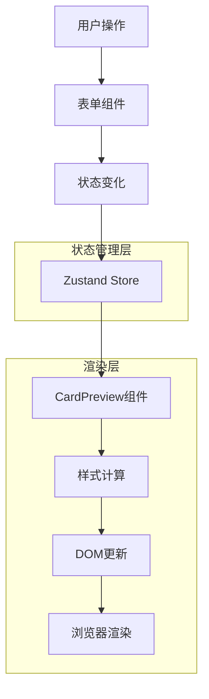
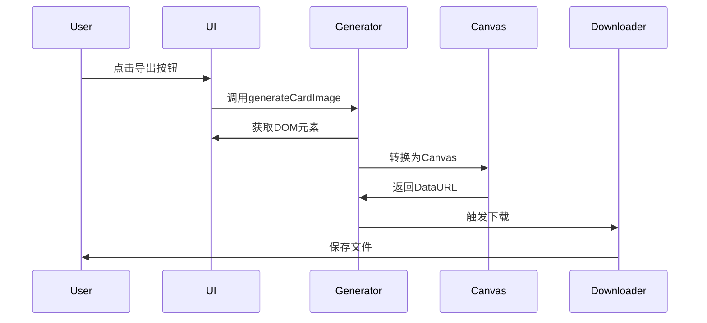

# 导出与预览流程设计文档

## 1. 预览系统架构

### 1.1 实时预览架构


### 1.2 预览组件结构
```typescript
// 预览组件核心结构
interface CardPreviewProps {
  cardData: CardData;
  templateType: 'portrait' | 'landscape';
  className?: string;
}

const CardPreview: React.FC<CardPreviewProps> = ({ 
  cardData, 
  templateType,
  className 
}) => {
  // 样式计算
  const styles = useMemo(() => calculateStyles(cardData), [cardData]);
  
  // 布局计算
  const layout = useMemo(() => calculateLayout(templateType), [templateType]);
  
  return (
    <div className={`card-preview ${templateType} ${className}`} style={styles}>
      {/* 动态渲染卡片内容 */}
      <CardContent data={cardData} layout={layout} />
    </div>
  );
};
```

## 2. 图片生成流程

### 2.1 生成流程图


### 2.2 图片生成核心算法
```typescript
// 图片生成核心函数
export const generateCardImage = async (
  element: HTMLElement,
  options: GenerateOptions = {}
): Promise<GenerateResult> => {
  try {
    // 1. 准备元素样式
    const originalStyles = prepareElement(element);
    
    // 2. 配置生成选项
    const generateOptions = {
      width: options.width || 1080,
      height: options.height || 1920,
      quality: options.quality || 0.95,
      backgroundColor: options.backgroundColor || '#ffffff',
      scale: options.scale || 2,
      ...options
    };
    
    // 3. 生成图片
    const dataURL = await htmlToImage.toPng(element, generateOptions);
    
    // 4. 恢复原始样式
    restoreElement(element, originalStyles);
    
    return {
      success: true,
      dataURL,
      size: dataURL.length
    };
  } catch (error) {
    console.error('图片生成失败:', error);
    
    // 5. 错误处理
    return {
      success: false,
      error: error.message,
      fallback: await tryFallbackGeneration(element, options)
    };
  }
};
```

### 2.3 元素预处理
```typescript
// 元素样式预处理
const prepareElement = (element: HTMLElement): OriginalStyles => {
  const styles: OriginalStyles = {
    originalWidth: element.style.width,
    originalHeight: element.style.height,
    originalOverflow: element.style.overflow
  };
  
  // 设置生成时的样式
  element.style.width = '1080px';
  element.style.height = '1920px';
  element.style.overflow = 'visible';
  
  // 处理字体加载
  await waitForFonts();
  
  // 处理图片加载
  await waitForImages(element);
  
  return styles;
};

// 等待字体加载完成
const waitForFonts = async (): Promise<void> => {
  if (document.fonts && document.fonts.ready) {
    await document.fonts.ready;
  }
};

// 等待图片加载完成
const waitForImages = async (element: HTMLElement): Promise<void> => {
  const images = element.querySelectorAll('img');
  const imagePromises = Array.from(images).map(img => {
    if (img.complete) return Promise.resolve();
    return new Promise((resolve) => {
      img.addEventListener('load', resolve);
      img.addEventListener('error', resolve);
    });
  });
  
  await Promise.all(imagePromises);
};
```

## 3. 导出格式处理

### 3.1 PNG导出
```typescript
// PNG格式导出
export const downloadImage = (dataURL: string, filename: string): void => {
  // 1. 创建下载链接
  const link = document.createElement('a');
  link.download = filename;
  link.href = dataURL;
  
  // 2. 触发下载
  document.body.appendChild(link);
  link.click();
  
  // 3. 清理
  document.body.removeChild(link);
  
  // 4. 释放内存
  URL.revokeObjectURL(dataURL);
};

// DataURL转换为Blob
export const dataURLToBlob = (dataURL: string): Blob | null => {
  try {
    const parts = dataURL.split(',');
    const header = parts[0];
    const data = parts[1];
    
    const mime = header.match(/:(.*?);/)?.[1] || 'image/png';
    const binary = atob(data);
    const array = new Uint8Array(binary.length);
    
    for (let i = 0; i < binary.length; i++) {
      array[i] = binary.charCodeAt(i);
    }
    
    return new Blob([array], { type: mime });
  } catch (error) {
    console.error('DataURL转换失败:', error);
    return null;
  }
};
```

### 3.2 PDF导出
```typescript
// PDF格式导出
export const downloadPdfFromDataURL = async (
  dataURL: string, 
  filename: string,
  options: PdfOptions = {}
): Promise<void> => {
  try {
    // 1. 创建PDF文档
    const pdf = new jsPDF({
      orientation: options.orientation || 'portrait',
      unit: 'px',
      format: options.format || [1080, 1920]
    });
    
    // 2. 添加图片
    const imageData = dataURL.split(',')[1];
    pdf.addImage(
      imageData, 
      'PNG', 
      0, 
      0, 
      options.width || 1080, 
      options.height || 1920
    );
    
    // 3. 保存PDF
    pdf.save(filename.replace('.png', '.pdf'));
  } catch (error) {
    console.error('PDF生成失败:', error);
    
    // 4. 降级处理
    const pngFilename = filename.replace('.pdf', '.png');
    downloadImage(dataURL, pngFilename);
  }
};
```

### 3.3 批量导出
```typescript
// 批量导出处理
export const batchExport = async (
  items: CardData[],
  format: 'png' | 'pdf',
  options: BatchOptions = {}
): Promise<void> => {
  const zip = new JSZip();
  const promises: Promise<void>[] = [];
  
  // 1. 创建进度跟踪
  const progress = {
    total: items.length,
    completed: 0,
    errors: 0
  };
  
  // 2. 并行处理
  for (let i = 0; i < items.length; i++) {
    const item = items[i];
    const promise = processBatchItem(item, format, zip, options)
      .then(() => {
        progress.completed++;
        options.onProgress?.(progress);
      })
      .catch((error) => {
        progress.errors++;
        console.error(`处理项目 ${i} 失败:`, error);
      });
    
    promises.push(promise);
    
    // 3. 控制并发数量
    if (promises.length >= options.concurrency || 5) {
      await Promise.all(promises);
      promises.length = 0;
    }
  }
  
  // 4. 等待所有任务完成
  if (promises.length > 0) {
    await Promise.all(promises);
  }
  
  // 5. 生成压缩包
  const zipBlob = await zip.generateAsync({ type: 'blob' });
  
  // 6. 下载压缩包
  const timestamp = new Date().toISOString().replace(/[:.]/g, '-');
  saveAs(zipBlob, `直播手卡批量导出_${timestamp}.zip`);
};
```

## 4. 预览优化

### 4.1 性能优化
```typescript
// 预览性能优化
const OptimizedCardPreview = React.memo(({ cardData, templateType }) => {
  // 1. 使用useMemo缓存计算结果
  const processedData = useMemo(() => {
    return processCardData(cardData);
  }, [cardData]);
  
  // 2. 使用useCallback缓存函数
  const handleImageLoad = useCallback((img) => {
    // 图片加载完成后的处理
    adjustImageSize(img);
  }, []);
  
  // 3. 虚拟化长列表
  const visibleItems = useVirtualization(cardData.items, viewport);
  
  return (
    <div className="card-preview">
      {visibleItems.map(item => (
        <CardItem key={item.id} data={item} onImageLoad={handleImageLoad} />
      ))}
    </div>
  );
});
```

### 4.2 响应式预览
```typescript
// 响应式预览适配
const useResponsivePreview = () => {
  const [dimensions, setDimensions] = useState({ width: 1080, height: 1920 });
  const [scale, setScale] = useState(1);
  
  useEffect(() => {
    const updateDimensions = () => {
      const container = document.querySelector('.preview-container');
      if (!container) return;
      
      const containerWidth = container.clientWidth;
      const containerHeight = container.clientHeight;
      
      // 计算适配比例
      const scaleX = containerWidth / 1080;
      const scaleY = containerHeight / 1920;
      const optimalScale = Math.min(scaleX, scaleY, 1);
      
      setScale(optimalScale);
      setDimensions({
        width: 1080 * optimalScale,
        height: 1920 * optimalScale
      });
    };
    
    updateDimensions();
    window.addEventListener('resize', updateDimensions);
    
    return () => window.removeEventListener('resize', updateDimensions);
  }, []);
  
  return { dimensions, scale };
};
```

### 4.3 实时更新优化
```typescript
// 实时更新防抖
const useDebouncedUpdate = (callback: Function, delay: number = 300) => {
  const timeoutRef = useRef<NodeJS.Timeout>();
  
  const debouncedCallback = useCallback((...args: any[]) => {
    // 清除之前的定时器
    if (timeoutRef.current) {
      clearTimeout(timeoutRef.current);
    }
    
    // 设置新的定时器
    timeoutRef.current = setTimeout(() => {
      callback(...args);
    }, delay);
  }, [callback, delay]);
  
  // 清理定时器
  useEffect(() => {
    return () => {
      if (timeoutRef.current) {
        clearTimeout(timeoutRef.current);
      }
    };
  }, []);
  
  return debouncedCallback;
};
```

## 5. 错误处理与降级

### 5.1 生成失败处理
```typescript
// 错误处理机制
const tryFallbackGeneration = async (
  element: HTMLElement, 
  options: GenerateOptions
): Promise<string | null> => {
  // 1. 尝试html2canvas
  try {
    const canvas = await html2canvas(element, {
      scale: options.scale || 2,
      useCORS: true,
      allowTaint: true,
      backgroundColor: options.backgroundColor
    });
    
    return canvas.toDataURL('image/png', options.quality);
  } catch (html2canvasError) {
    console.warn('html2canvas失败:', html2canvasError);
  }
  
  // 2. 尝试modern-screenshot
  try {
    return await modernScreenshot.elementToPng(element, {
      scale: options.scale || 2,
      quality: options.quality
    });
  } catch (modernError) {
    console.warn('modern-screenshot失败:', modernError);
  }
  
  // 3. 最终降级方案
  console.error('所有生成方法都失败');
  return null;
};
```

### 5.2 浏览器兼容性
```typescript
// 浏览器兼容性检测
const checkBrowserCompatibility = (): CompatibilityResult => {
  const result: CompatibilityResult = {
    supported: true,
    warnings: [],
    errors: []
  };
  
  // 检测html-to-image支持
  if (!window.htmlToImage) {
    result.warnings.push('html-to-image库加载失败');
  }
  
  // 检测Canvas支持
  if (!document.createElement('canvas').getContext) {
    result.errors.push('浏览器不支持Canvas');
    result.supported = false;
  }
  
  // 检测跨域图片支持
  if (!('crossOrigin' in new Image())) {
    result.warnings.push('跨域图片可能无法正常显示');
  }
  
  return result;
};
```

## 6. 性能监控

### 6.1 生成性能监控
```typescript
// 性能监控
const monitorGenerationPerformance = async (
  operation: () => Promise<any>
): Promise<PerformanceMetrics> => {
  const metrics: PerformanceMetrics = {
    startTime: performance.now(),
    memoryStart: performance.memory?.usedJSHeapSize || 0
  };
  
  try {
    const result = await operation();
    
    metrics.endTime = performance.now();
    metrics.memoryEnd = performance.memory?.usedJSHeapSize || 0;
    metrics.duration = metrics.endTime - metrics.startTime;
    metrics.memoryUsed = metrics.memoryEnd - metrics.memoryStart;
    metrics.success = true;
    
    return metrics;
  } catch (error) {
    metrics.endTime = performance.now();
    metrics.duration = metrics.endTime - metrics.startTime;
    metrics.success = false;
    metrics.error = error.message;
    
    return metrics;
  }
};
```

### 6.2 用户体验监控
```typescript
// 用户体验指标
const trackUserExperience = (metrics: PerformanceMetrics) => {
  // 发送性能数据到分析服务
  if (window.gtag) {
    window.gtag('event', 'card_generation_complete', {
      duration: Math.round(metrics.duration),
      success: metrics.success,
      memory_used: metrics.memoryUsed,
      error_type: metrics.error ? 'generation_error' : undefined
    });
  }
  
  // 控制台日志
  if (metrics.duration > 5000) {
    console.warn(`卡片生成耗时过长: ${metrics.duration}ms`);
  }
  
  if (metrics.memoryUsed > 50 * 1024 * 1024) { // 50MB
    console.warn(`内存使用过高: ${metrics.memoryUsed / 1024 / 1024}MB`);
  }
};
```