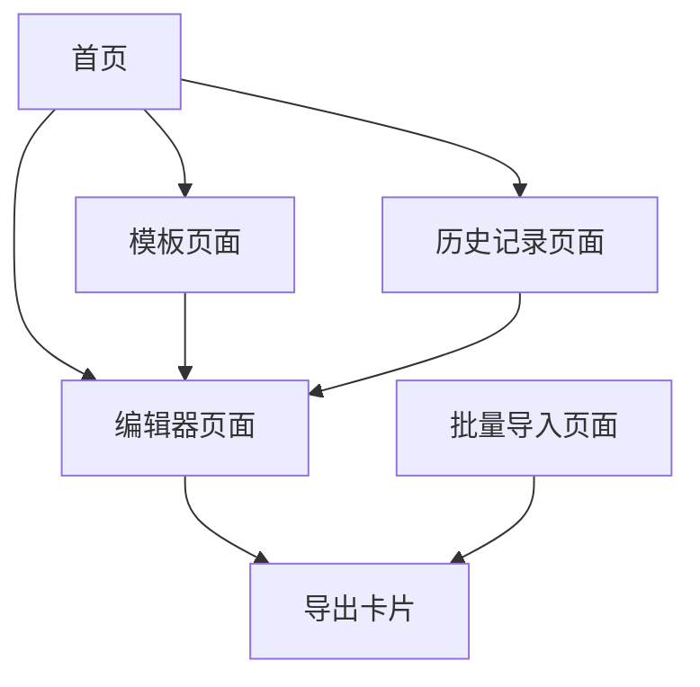

## 1. 产品概述

直播手卡生成器是一款专为电商直播设计的卡片制作工具，帮助主播快速生成专业的商品介绍卡片。产品解决直播过程中商品信息展示不规范、制作效率低的问题，通过模板化和自动化功能提升直播效率。

目标用户为电商主播、品牌商家和直播运营人员，提供简单易用的卡片编辑和导出功能，支持多种平台和格式输出。

## 2. 核心功能

### 2.1 用户角色

| 角色 | 注册方式 | 核心权限 |
|------|----------|----------|
| 普通用户 | 邮箱注册 | 创建、编辑、导出卡片，查看个人历史记录 |
| 高级用户 | 邀请码升级 | 使用高级模板、批量导入、团队协作功能 |

### 2.2 功能模块

我们的直播手卡生成器包含以下主要页面：

1. **首页**: 功能导航、模板展示、快速开始入口
2. **编辑器页面**: 卡片编辑、实时预览、导出功能
3. **模板页面**: 模板浏览、分类筛选、模板应用
4. **历史记录页面**: 历史作品管理、重新编辑、批量操作
5. **批量导入页面**: Excel文件上传、数据映射、批量生成
6. **个人中心**: 用户信息、设置、订阅管理

### 2.3 页面详情

| 页面名称 | 模块名称 | 功能描述 |
|----------|----------|----------|
| 首页 | 导航栏 | 显示Logo、主要功能入口、用户登录状态 |
| 首页 | 功能卡片 | 展示核心功能（创建卡片、模板库、历史记录） |
| 首页 | 模板预览 | 轮播展示热门模板，支持快速预览 |
| 编辑器页面 | 基础信息表单 | 输入平台选择、商品标题、品牌信息 |
| 编辑器页面 | 价格设置表单 | 设置市场价、直播价、折扣信息、佣金比例 |
| 编辑器页面 | 图片上传模块 | 上传商品主图、背面图，支持裁剪和调整 |
| 编辑器页面 | 尺寸信息表单 | 编辑尺码表、身高体重推荐、尺码备注 |
| 编辑器页面 | 发货信息表单 | 设置发货类型、发货时间、退换政策、福利活动 |
| 编辑器页面 | 实时预览区域 | 实时显示卡片效果，支持横版/竖版切换 |
| 编辑器页面 | 导出功能区 | 支持PNG/PDF格式导出，一键下载 |
| 模板页面 | 模板分类 | 按行业、风格、平台分类展示模板 |
| 模板页面 | 模板搜索 | 关键词搜索、筛选功能 |
| 模板页面 | 模板应用 | 一键应用模板到编辑器 |
| 历史记录页面 | 作品列表 | 网格/列表展示历史作品，显示预览图和创建时间 |
| 历史记录页面 | 作品操作 | 重新编辑、删除、批量管理功能 |
| 批量导入页面 | 文件上传 | Excel文件上传和解析 |
| 批量导入页面 | 数据映射 | 字段映射配置，数据预览 |
| 批量导入页面 | 批量生成 | 一键生成多个卡片，进度显示 |
| 个人中心 | 用户信息 | 显示头像、昵称、会员等级 |
| 个人中心 | 设置选项 | 修改密码、通知设置、导出设置 |

## 3. 核心流程

### 3.1 创建卡片流程
用户进入编辑器 → 填写基础信息 → 设置价格和图片 → 编辑尺寸信息 → 配置发货信息 → 实时预览 → 导出卡片

### 3.2 模板使用流程
浏览模板库 → 选择合适模板 → 预览模板效果 → 应用模板到编辑器 → 自定义编辑内容 → 导出成品

### 3.3 批量导入流程
上传Excel文件 → 系统解析数据 → 字段映射配置 → 预览导入结果 → 批量生成卡片 → 打包下载

## 4. 用户界面设计

### 4.1 设计风格
- **主色调**: 活力橙色 (#FF6B35) 搭配白色背景
- **辅助色**: 深灰色 (#2D3748) 用于文字，浅灰色 (#F7FAFC) 用于背景
- **按钮风格**: 圆角矩形，主要按钮使用渐变色，次要按钮使用边框
- **字体**: 优先使用系统字体，标题使用加粗字体，正文字体大小14-16px
- **布局风格**: 卡片式布局，左右分栏设计，左侧表单右侧预览
- **图标风格**: 使用Lucide React图标库，线条简洁风格

### 4.2 页面设计概述

| 页面名称 | 模块名称 | UI元素 |
|----------|----------|--------|
| 首页 | 导航栏 | 白色背景，Logo居左，导航菜单居中，用户头像居右 |
| 首页 | 功能卡片 | 网格布局，每个卡片包含图标、标题、描述，悬停有阴影效果 |
| 编辑器页面 | 左侧表单区 | 标签页切换，每个表单分组显示相关字段，输入框带标签 |
| 编辑器页面 | 右侧预览区 | 卡片容器固定比例，支持缩放，显示实时预览效果 |
| 模板页面 | 模板网格 | 响应式网格布局，模板卡片显示缩略图和名称 |
| 历史记录页面 | 作品网格 | 网格展示历史作品缩略图，显示创建时间和操作按钮 |

### 4.3 响应式设计
采用桌面端优先设计，适配1200px以上桌面屏幕，平板端优化布局，移动端采用单列布局。触摸交互优化，按钮大小适合触摸操作。

### 4.4 导出格式规范
- PNG格式：支持1080x1920（竖版）和1920x1080（横版）两种分辨率
- PDF格式：自动分页，支持高质量打印输出
- 文件命名：直播手卡_时间戳.扩展名