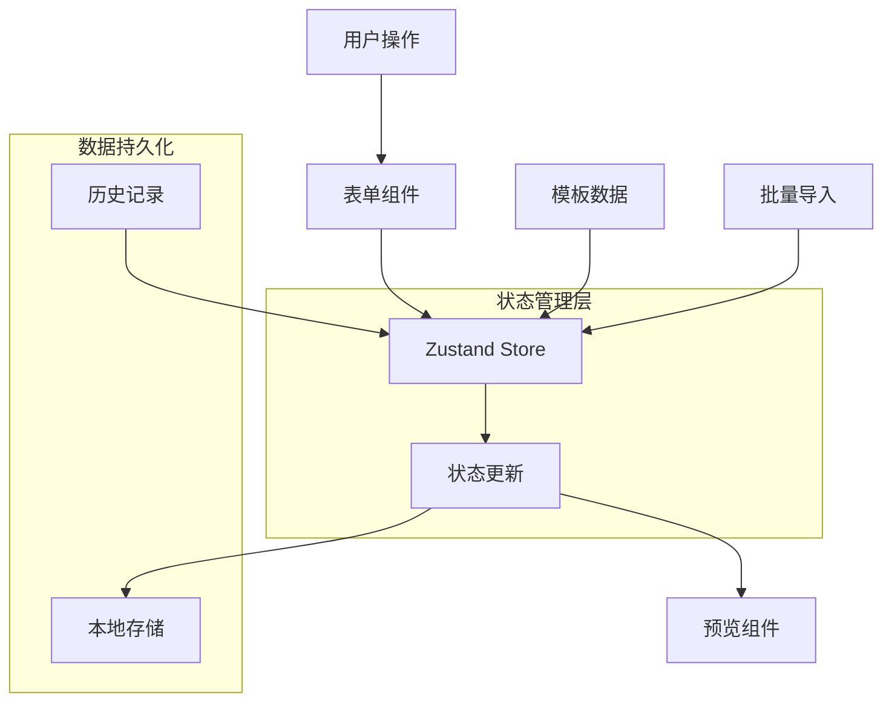
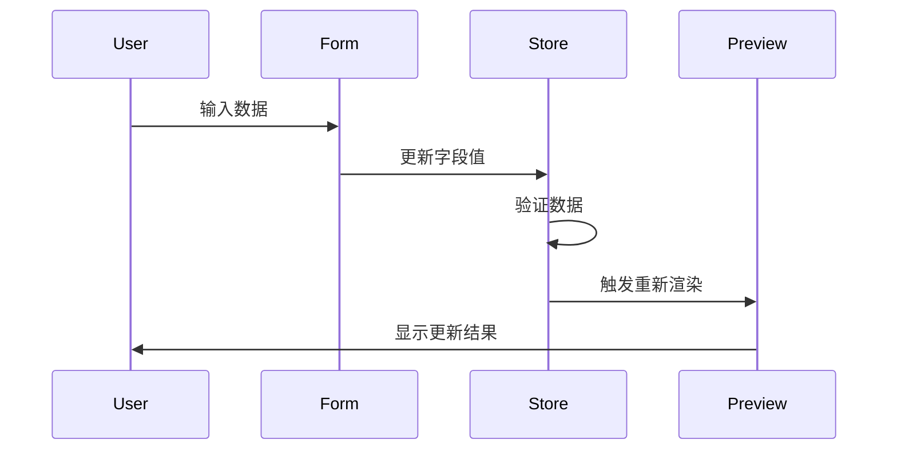

# 状态联动与数据流设计文档

## 1. 状态管理架构

### 1.1 整体架构图


### 1.2 状态分层设计
- **应用级状态**: 使用Zustand集中管理
- **组件级状态**: 使用React useState局部管理
- **本地存储**: localStorage持久化关键数据
- **临时状态**: 表单验证、UI状态等

## 2. 数据流设计

### 2.1 单向数据流
```
用户输入 → 表单组件 → 状态更新 → 预览更新 → 本地存储
```

### 2.2 状态更新机制
- **同步更新**: 表单字段直接更新状态
- **批量更新**: 多个相关字段一次性更新
- **异步更新**: 图片上传、文件处理等异步操作
- **防抖更新**: 频繁操作添加防抖机制

### 2.3 数据同步策略
```typescript
// 状态同步示例
const updateCardData = (data: Partial<CardData>) => {
  set((state) => ({
    cardData: { ...state.cardData, ...data }
  }));
  
  // 自动保存到本地存储
  debouncedSave();
};
```

## 3. 组件状态联动

### 3.1 表单与预览联动


### 3.2 模板应用联动
```typescript
// 模板应用流程
const applyTemplate = (template: CardTemplate) => {
  // 1. 清空当前数据
  resetCardData();
  
  // 2. 应用模板数据
  updateCardData(template.templateData);
  
  // 3. 更新UI状态
  setTemplateType(template.layout || 'portrait');
  
  // 4. 跳转到编辑器
  navigate('/editor');
};
```

### 3.3 历史记录联动
```typescript
// 历史记录恢复
const restoreFromHistory = (entry: CardHistoryEntry) => {
  // 1. 恢复数据状态
  setCardData(entry.data);
  
  // 2. 恢复预览状态
  setPreviewUrl(entry.previewUrl);
  
  // 3. 更新编辑器状态
  setActiveTab('basic');
  
  // 4. 标记为已修改
  setHasChanges(true);
};
```

## 4. 状态一致性保证

### 4.1 数据验证机制
```typescript
// 表单验证
const validateCardData = (data: CardData): ValidationResult => {
  const errors: ValidationError[] = [];
  
  // 必填字段验证
  if (!data.productTitle) {
    errors.push({ field: 'productTitle', message: '商品标题不能为空' });
  }
  
  // 价格逻辑验证
  if (data.livePrice >= data.marketPrice) {
    errors.push({ field: 'livePrice', message: '直播价应低于市场价' });
  }
  
  return { isValid: errors.length === 0, errors };
};
```

### 4.2 状态回滚机制
```typescript
// 操作历史管理
const operationHistory: Operation[] = [];
let currentIndex = -1;

const pushOperation = (operation: Operation) => {
  // 移除当前索引之后的操作
  operationHistory.splice(currentIndex + 1);
  
  // 添加新操作
  operationHistory.push(operation);
  currentIndex++;
  
  // 限制历史记录长度
  if (operationHistory.length > MAX_HISTORY) {
    operationHistory.shift();
    currentIndex--;
  }
};

const undo = () => {
  if (currentIndex >= 0) {
    const operation = operationHistory[currentIndex];
    operation.undo();
    currentIndex--;
  }
};
```

### 4.3 并发控制
```typescript
// 防止重复提交
const [isSubmitting, setIsSubmitting] = useState(false);

const handleSubmit = async () => {
  if (isSubmitting) return;
  
  setIsSubmitting(true);
  try {
    await submitData();
  } finally {
    setIsSubmitting(false);
  }
};
```

## 5. 性能优化策略

### 5.1 防抖与节流
```typescript
// 防抖函数
const debounce = (func: Function, delay: number) => {
  let timeoutId: NodeJS.Timeout;
  return (...args: any[]) => {
    clearTimeout(timeoutId);
    timeoutId = setTimeout(() => func.apply(null, args), delay);
  };
};

// 应用防抖
const debouncedUpdate = debounce(updateCardData, 300);
```

### 5.2 选择性更新
```typescript
// 使用浅比较避免不必要的重渲染
const useCardField = (field: keyof CardData) => {
  return useCardStore(
    useCallback((state) => state.cardData[field], [field])
  );
};
```

### 5.3 虚拟化长列表
```typescript
// 历史记录虚拟滚动
const VirtualizedHistoryList = ({ items, itemHeight, containerHeight }) => {
  const [startIndex, setStartIndex] = useState(0);
  const [endIndex, setEndIndex] = useState(0);
  
  const visibleItems = items.slice(startIndex, endIndex);
  
  return (
    <div style={{ height: containerHeight, overflow: 'auto' }}>
      <div style={{ height: items.length * itemHeight }}>
        {visibleItems.map((item, index) => (
          <div key={item.id} style={{ height: itemHeight }}>
            <HistoryItem item={item} />
          </div>
        ))}
      </div>
    </div>
  );
};
```

## 6. 错误处理与恢复

### 6.1 状态异常处理
```typescript
// 状态异常捕获
const safeUpdateCardData = (updater: (data: CardData) => CardData) => {
  try {
    const newData = updater(get().cardData);
    
    // 数据验证
    if (validateCardData(newData).isValid) {
      set({ cardData: newData });
    } else {
      console.warn('Invalid card data update prevented');
    }
  } catch (error) {
    console.error('Error updating card data:', error);
    // 恢复到上一个有效状态
    rollbackToLastValidState();
  }
};
```

### 6.2 本地存储错误处理
```typescript
// 安全的本地存储操作
const safeLocalStorage = {
  setItem: (key: string, value: string) => {
    try {
      localStorage.setItem(key, value);
    } catch (error) {
      if (error.name === 'QuotaExceededError') {
        // 清理旧数据
        cleanupOldData();
        // 重试
        try {
          localStorage.setItem(key, value);
        } catch (retryError) {
          console.error('Failed to save to localStorage after cleanup');
        }
      }
    }
  },
  
  getItem: (key: string): string | null => {
    try {
      return localStorage.getItem(key);
    } catch (error) {
      console.error('Error reading from localStorage:', error);
      return null;
    }
  }
};
```

## 7. 调试与监控

### 7.1 状态变化日志
```typescript
// 开发环境状态变化日志
const createDebugStore = (config) => {
  return (set, get, api) => {
    const originalSet = set;
    
    const debugSet = (partial, replace) => {
      console.group('State Update');
      console.log('Previous:', get());
      console.log('Update:', partial);
      
      const result = originalSet(partial, replace);
      
      console.log('Next:', get());
      console.groupEnd();
      
      return result;
    };
    
    return config(debugSet, get, api);
  };
};
```

### 7.2 性能监控
```typescript
// 性能监控
const measurePerformance = (operation: string, fn: Function) => {
  return (...args: any[]) => {
    const start = performance.now();
    const result = fn(...args);
    const end = performance.now();
    
    console.log(`${operation} took ${end - start}ms`);
    
    // 发送性能指标
    if (window.gtag) {
      window.gtag('event', 'timing_complete', {
        name: operation,
        value: Math.round(end - start)
      });
    }
    
    return result;
  };
};
```

## 8. 状态迁移与版本管理

### 8.1 数据结构迁移
```typescript
// 状态版本管理
const MIGRATIONS = {
  1: (state) => ({
    ...state,
    // 添加新字段
    version: 1,
    newField: defaultValue
  }),
  2: (state) => ({
    ...state,
    // 重命名字段
    version: 2,
    renamedField: state.oldField,
    oldField: undefined
  })
};

const migrateState = (state: any, currentVersion: number): any => {
  let migratedState = state;
  
  while (migratedState.version < currentVersion) {
    const nextVersion = migratedState.version + 1;
    const migration = MIGRATIONS[nextVersion];
    
    if (migration) {
      migratedState = migration(migratedState);
    } else {
      break;
    }
  }
  
  return migratedState;
};
```

### 8.2 向后兼容性
```typescript
// 兼容旧版本数据
const normalizeCardData = (data: any): CardData => {
  return {
    ...defaultCardData,
    ...data,
    // 确保必需字段存在
    platforms: data.platforms || ['小红书'],
    productTitle: data.productTitle || '',
    // 处理废弃字段
    deprecatedField: undefined
  };
};
```