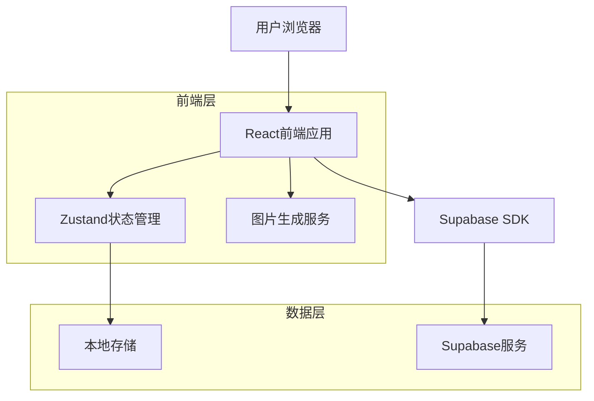

## 1. 架构设计



## 2. 技术描述

- **前端**: React@18 + TypeScript + TailwindCSS@3 + Vite
- **初始化工具**: vite-init
- **状态管理**: Zustand@5
- **UI组件**: @headlessui/react, @radix-ui/react-*
- **路由**: react-router-dom@7
- **图标**: lucide-react
- **表单**: react-hook-form + zod
- **图片处理**: html-to-image, html2canvas, modern-screenshot
- **文件处理**: xlsx, jszip, file-saver
- **PDF生成**: jspdf
- **后端**: Supabase (认证 + 数据库 + 存储)
- **部署**: 静态网站托管

## 3. 路由定义

| 路由 | 用途 |
|------|------|
| / | 首页，展示功能导航和模板预览 |
| /editor | 编辑器页面，创建和编辑卡片 |
| /templates | 模板页面，浏览和选择模板 |
| /history | 历史记录页面，管理历史作品 |
| /bulk | 批量导入页面，Excel批量处理 |
| /profile | 个人中心，用户信息和设置 |
| /login | 登录页面 |
| /register | 注册页面 |

## 4. 状态管理架构

### 4.1 核心状态结构
```typescript
interface CardState {
  cardData: CardData;           // 卡片数据
  isGenerating: boolean;         // 生成状态
  previewUrl: string | null;   // 预览URL
  history: CardHistoryEntry[]; // 历史记录
}
```

### 4.2 状态管理方法
- **updateCardData**: 更新卡片数据
- **updateBasicInfo**: 更新基础信息
- **updateMaterials**: 更新材料信息
- **updateDesigns**: 更新设计特点
- **updatePriceInfo**: 更新价格信息
- **updateImages**: 更新图片
- **updateSizeInfo**: 更新尺寸信息
- **updateBenefits**: 更新福利活动
- **setGenerating**: 设置生成状态
- **setPreviewUrl**: 设置预览URL
- **resetCardData**: 重置卡片数据
- **addHistoryEntry**: 添加历史记录
- **removeHistoryEntry**: 删除历史记录
- **upsertHistoryByName**: 按名称更新历史记录

## 5. 组件架构

### 5.1 页面组件
```
src/pages/
├── HomePage.tsx          # 首页
├── EditorPage.tsx        # 编辑器页面
├── TemplatesPage.tsx     # 模板页面
├── HistoryPage.tsx       # 历史记录页面
├── BulkImportPage.tsx    # 批量导入页面
├── ProfilePage.tsx       # 个人中心
├── LoginPage.tsx         # 登录页面
└── RegisterPage.tsx      # 注册页面
```

### 5.2 核心组件
```
src/components/
├── Layout.tsx            # 布局组件
├── CardPreview.tsx       # 卡片预览
├── BasicInfoForm.tsx     # 基础信息表单
├── PriceForm.tsx         # 价格表单
├── ImageUpload.tsx       # 图片上传
├── SizeChartForm.tsx     # 尺寸表单
├── BenefitsForm.tsx      # 福利表单
├── HistoryTab.tsx        # 历史标签
└── Empty.tsx             # 空状态组件
```

### 5.3 工具函数
```
src/utils/
├── imageGenerator.ts     # 图片生成
└── excel.ts              # Excel处理
```

## 6. 数据模型

### 6.1 核心数据类型
```typescript
interface CardData {
  // 基础信息
  platforms: string[];
  productTitle: string;
  brandName?: string;
  brandLogo?: string;
  materials: MaterialItem[];
  designs: DesignItem[];
  
  // 价格信息
  marketPrice: number;
  livePrice: number;
  discount: string;
  commission: number;
  
  // 图片信息
  mainImage: string;
  backImage?: string;
  
  // 尺寸信息
  sizeChart: SizeChart;
  sizeRecommendations: SizeRecommendation[];
  
  // 福利活动
  benefits: string[];
  activityTime: string;
  shippingInfo: ShippingInfo;
  command: string;
  
  // 其他信息
  color: string;
  colors?: string[];
  sizes: string[];
  sizeNotes?: { [size: string]: string };
}
```

### 6.2 历史记录模型
```typescript
interface CardHistoryEntry {
  id: string;
  name: string;
  createdAt: number;
  data: CardData;
  previewUrl?: string | null;
}
```

### 6.3 模板模型
```typescript
interface CardTemplate {
  id: string;
  name: string;
  description?: string;
  templateData: Partial<CardData>;
  thumbnailUrl?: string;
  isPublic?: boolean;
}
```

## 7. 核心功能实现

### 7.1 卡片生成流程
1. 用户填写表单数据
2. 实时更新Zustand状态
3. CardPreview组件订阅状态变化
4. 点击导出按钮触发generateCardImage
5. html-to-image转换DOM为图片
6. 下载生成的图片文件

### 7.2 图片处理机制
- **上传处理**: FileReader读取文件，转换为base64
- **预览显示**: 使用URL.createObjectURL创建临时URL
- **图片生成**: html-to-image库将DOM元素转换为canvas
- **格式转换**: 支持PNG和PDF两种输出格式
- **批量处理**: 循环处理多个卡片，使用JSZip打包

### 7.3 本地存储策略
- **历史记录**: localStorage存储卡片历史
- **自动保存**: 定时保存当前编辑状态
- **数据恢复**: 页面刷新后恢复编辑状态
- **缓存机制**: 模板数据缓存到localStorage

## 8. 性能优化

### 8.1 渲染优化
- **React.memo**: 对纯展示组件进行缓存
- **useMemo**: 缓存计算结果
- **虚拟滚动**: 历史记录列表使用虚拟滚动
- **图片懒加载**: 模板图片按需加载

### 8.2 打包优化
- **代码分割**: 按路由进行代码分割
- **动态导入**: 大组件按需加载
- **Tree Shaking**: 移除未使用代码
- **压缩优化**: 图片和资源压缩

### 8.3 缓存策略
- **浏览器缓存**: 静态资源设置长期缓存
- **Service Worker**: 离线缓存关键资源
- **CDN加速**: 使用CDN加速静态资源

## 9. 错误处理

### 9.1 图片生成错误
- 捕获html-to-image转换错误
- 提供友好的错误提示
- 自动降级到备用方案

### 9.2 文件上传错误
- 文件格式验证
- 文件大小限制
- 上传失败重试机制

### 9.3 本地存储错误
- localStorage容量检测
- 数据格式验证
- 异常数据清理

## 10. 安全考虑

### 10.1 XSS防护
- React默认的XSS防护
- 用户输入内容转义
- 富文本内容过滤

### 10.2 CSRF防护
- 使用POST请求进行数据修改
- 验证请求来源
- 添加请求头验证

### 10.3 数据安全
- 敏感数据加密存储
- API密钥安全存储
- HTTPS强制使用